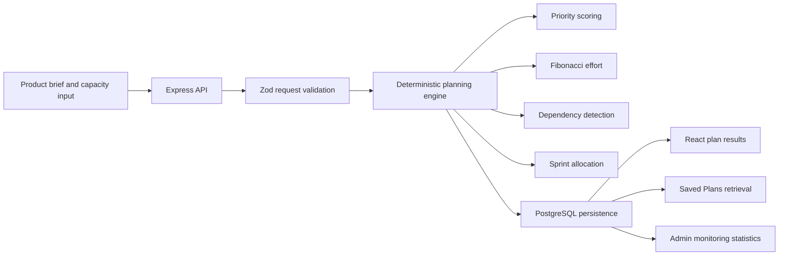

# SprintForge

SprintForge is an explainable product-planning workspace. A product manager enters a feature brief and delivery constraints, and the application produces a PRD, user stories, engineering tasks, priority scores, effort estimates, dependency order, and a capacity-aware sprint plan.

## Problem statement

Product ideas often reach engineering as incomplete briefs. Teams then spend time translating vague requirements into actionable work, deciding what is urgent, estimating effort, finding dependencies, and checking whether the work fits available sprint capacity. SprintForge makes that translation repeatable and transparent while keeping the final decision with the product and engineering team.

## Assignment objectives covered

- Collect a structured product brief and delivery capacity.
- Validate the brief before processing.
- Generate a PRD, user stories, engineering tasks, priorities, estimates, dependencies, and sprint allocations.
- Persist generated plans and processing status in Replit PostgreSQL.
- Retrieve, rename, delete, copy, and export saved plans.
- Show live workflow statistics in an admin monitoring view.
- Keep planning decisions deterministic, explainable, and reproducible.
- Provide loading, empty, success, and error states across the workflow.
- Support desktop and mobile layouts without requiring an AI provider.

## Main features

- **New Feature Plan** — captures title, description, target users, business goal, main problem, requirements, constraints, sprint length, team capacity, and number of sprints.
- **Generated plan** — presents PRD, stories, tasks, sprint plan, risks and metrics, and the reasoning behind planning decisions.
- **Priority scoring** — scores every story and task using business value, user impact, urgency, and risk reduction.
- **Effort estimation** — assigns transparent Fibonacci effort points.
- **Dependency-aware allocation** — orders work across database, backend, frontend, testing, and deployment categories.
- **Saved Plans** — lists persisted plans with search, open, rename, and delete actions.
- **Copy and Markdown export** — copies the PRD or downloads the complete plan as Markdown.
- **Admin monitoring** — derives plan, story, task, processing-run, priority, sprint-capacity, and recent-activity statistics from stored records.

## Technology stack

- React + TypeScript + Vite
- Express 5 + TypeScript
- pnpm workspace monorepo
- Drizzle ORM
- Replit-managed PostgreSQL
- OpenAPI contract with generated API clients and Zod validation
- TanStack Query, React Hook Form, Wouter, Tailwind CSS, and Lucide icons
- Node.js 24

The generator works without an OpenAI API key. Rule-based processing was selected because its results are transparent, deterministic, reproducible, and easy to explain in an academic setting. AI could be added later as an optional enhancement, but it is intentionally not required for this project.

## End-to-end workflow



## Planning logic

### Priority-scoring formula

Each story and engineering task receives four component scores from 0–100:

```text
Priority score =
  business value × 35%
  + user impact × 30%
  + urgency × 20%
  + risk reduction × 15%
```

The result is rounded to the nearest whole number and labelled:

| Score range | Label |
| --- | --- |
| 80–100 | Critical |
| 60–79 | High |
| 40–59 | Medium |
| 0–39 | Low |

The score explanation is returned with each item, including the four component values and their weights.

### Effort-estimation approach

Effort uses Fibonacci points: `1, 2, 3, 5, 8, 13`.

- Short, bounded text starts with a small estimate.
- Longer requirements increase complexity.
- Integration, migration, permission, security, real-time, and analytics language increases complexity.
- API, database, schema, workflow, export, and dependency language adds implementation complexity.
- User stories receive an additional complexity step because they include product-facing acceptance work.
- The estimate includes a plain-language reason.

These are directional planning estimates, not commitments. The team should validate them during refinement.

### Dependency-detection rules

Generated work follows this category order:

```text
database → backend → frontend → testing → deployment
```

Each task can reference the latest earlier-category task as a prerequisite. Dependency IDs and human-readable dependency labels are stored with every engineering task. A dependent task is not placed in an earlier sprint than an assigned prerequisite.

### Sprint-allocation algorithm

1. Create the configured number of sprints, each with the configured team capacity.
2. Sort tasks by descending priority score, then by task ID for stable results.
3. Calculate the earliest eligible sprint from assigned dependencies.
4. Place the task in the first eligible sprint with enough remaining capacity.
5. Update used points, remaining points, task IDs, and task count.
6. Mark work as `unallocated` when no sprint has enough remaining points.

No sprint can exceed its configured capacity. The generated plan includes the allocation explanation and shows unallocated work explicitly.

## Database tables

The application uses Replit PostgreSQL for persistent storage through Drizzle ORM.

| Table | Purpose |
| --- | --- |
| `plans` | Original product inputs, processing status, generated PRD, decision explanations, and timestamps. |
| `user_stories` | Generated user stories, acceptance criteria, priority components, and effort estimates. |
| `engineering_tasks` | Task descriptions, categories, priority components, effort, dependencies, and sprint allocation. |
| `sprints` | Sprint number, duration, capacity, used points, remaining points, task IDs, and task count. |
| `processing_runs` | Creation activity, processing status, errors, start time, and completion time for monitoring. |

Child records reference `plans.id` and are deleted with their parent plan.

## Backend API

All endpoints are served below `/api`.

| Method | Endpoint | Purpose |
| --- | --- | --- |
| `GET` | `/api/healthz` | Health check for the API service. |
| `GET` | `/api/plans` | List saved plan summaries with story, task, and sprint counts. |
| `POST` | `/api/plans` | Validate, process, persist, and return a complete generated plan. |
| `GET` | `/api/plans/:id` | Retrieve a complete persisted plan and its generated child records. |
| `PATCH` | `/api/plans/:id` | Rename a saved plan. |
| `DELETE` | `/api/plans/:id` | Delete a plan and its dependent records. |
| `GET` | `/api/admin/stats` | Return live counts, priority distribution, sprint allocation, and recent processing activity. |

The API contract is defined in `lib/api-spec/openapi.yaml`. Generated client hooks and Zod schemas should be regenerated after contract changes.

## Local and Replit setup

### Replit

1. Provision or attach a Replit PostgreSQL database so `DATABASE_URL` is available.
2. Open the project and click **Run**. The configured Project workflow starts the API and SprintForge web workflows.
3. Use **New plan** to enter a brief and generate a plan.
4. Use **Saved plans** to verify persistence and **Monitoring** to inspect live statistics.

### Local development

Install dependencies with pnpm:

```bash
pnpm install
```

Run the API and frontend in separate terminals:

```bash
PORT=8080 pnpm --filter @workspace/api-server run dev
PORT=23888 BASE_PATH=/ pnpm --filter @workspace/sprintforge run dev
```

The Replit workflow/proxy is the supported integrated runtime because it routes the frontend and `/api` service together.

Apply schema changes only when needed:

```bash
pnpm --filter @workspace/db run push
```

### Environment variables

| Variable | Required | Purpose |
| --- | --- | --- |
| `DATABASE_URL` | Yes | Replit PostgreSQL connection string. |
| `PORT` | Yes | Port supplied to the API or Vite workflow. |
| `BASE_PATH` | Yes for the Vite app | Artifact base path supplied by the Replit workflow. `/` is suitable for a direct local run. |
| `NODE_ENV` | No | Enables production logging behavior when set to `production`; the API dev workflow sets `development`. |
| `LOG_LEVEL` | No | API logger level; defaults to `info`. |
| `TEST_BASE_URL` | No | Override the API base URL for the API flow regression test; defaults to `http://localhost:80/api`. |

SprintForge does not require authentication, `SESSION_SECRET`, or `OPENAI_API_KEY`. Do not commit `.env` files or secret values.

## Testing and build verification

Run the full typecheck:

```bash
pnpm run typecheck
```

Run deterministic planning, API persistence, and Markdown export regression tests:

```bash
pnpm run test
```

Run the production build with the environment required by the Vite artifacts:

```bash
PORT=23888 BASE_PATH=/ pnpm run build
```

The API flow test creates a temporary regression plan, verifies the stored result, renames it, checks admin statistics, and deletes it. It cleans up the created record.

## Known limitations

- Planning is deterministic and heuristic; it does not replace product discovery, stakeholder review, or technical refinement.
- The current project has no authentication or per-user plan ownership.
- The current UI targets the Replit workspace workflow and does not provide a separate local API proxy configuration.
- AI-assisted planning is not implemented and is not needed for the current workflow.
- Production geography, domains, and deployment settings are configured by the user in Replit Publishing rather than in application code.

## Future improvements

- Add authentication and workspace-level plan ownership.
- Add richer dependency graph visualization and manual task reordering.
- Add CSV/PDF export and import of existing requirements.
- Add optional AI-assisted suggestions behind an explicit provider configuration.
- Add CI checks for typecheck, tests, and the production build.
- Add historical plan comparison and planning-quality analytics.

## Short demonstration guide

See [`DEMO.md`](DEMO.md) for a 3–5 minute presentation script.

## Project structure

```text
artifacts/api-server/       Express API and deterministic planning engine
artifacts/sprintforge/      React/Vite application
lib/api-spec/               OpenAPI source contract
lib/api-client-react/       Generated React Query hooks
lib/api-zod/                Generated Zod request/response schemas
lib/db/                     Drizzle schema and PostgreSQL access
scripts/                    Workspace utility scripts
```